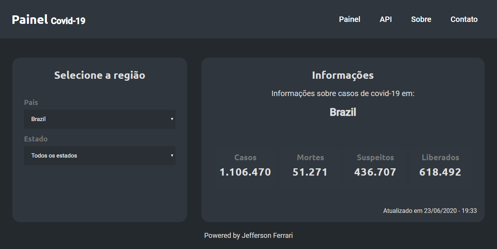

<div align="center">
<h1> :earth_americas: Painel de casos de covid-19</h1>
<p>Um painel com casos de coronavírus filtrando por país e/ou estado.</p>

<p align="center">
  <a href="#about">Sobre o projeto</a>&nbsp;&nbsp;&nbsp;|&nbsp;&nbsp;&nbsp;
  <a href="#tech">Tecnologias</a>&nbsp;&nbsp;&nbsp;|&nbsp;&nbsp;&nbsp;
  <a href="#get">Execução ou visualização</a>&nbsp;&nbsp;&nbsp;|&nbsp;&nbsp;&nbsp;
  <a href="#contribute">Como contribuir</a>&nbsp;&nbsp;&nbsp;|&nbsp;&nbsp;&nbsp;
  <a href="#creator">Criador</a>
</p>


</div>

<a id="about"></a>
## :book: Sobre o projeto

Este é um projeto criado com ReactJS, ele consome os dados de uma [API](https://covid19-brazil-api.now.sh/), mostra na tela os casos confirmados, casos suspeitos, liberados e mortes.

<a id="tech"></a>
## :artificial_satellite: Tecnologias

Para desenvolver este projeto eu usei as seguintes tecnologias:

- ReactJS
- Javascript
- React Router Dom
- Axios

<a id="get"></a>
## :rocket: Execução e/ou visualização

**Você pode acessar este projeto clicando [aqui](https://corona-v19.netlify.app)**

Para rodar em sua maquina:

- Clone este repositório com 
```git clone https://github.com/jefferson-calmon/covid19-painel.git```

- Rode ```cd covid19-painel``` para acessar o repositório.

- Rode ```npm install``` ou ```yarn install``` para instalar as dependências do projeto.

- Rode ```npm run dev``` ou ```yarn dev``` para iniciar o um servidor local com o projeto.

- Acesse em seu navegador
```
http://localhost:3000/
```

<a id="contribute"></a>
## :thinking: Como contribuir?

* Fork este repositório
* Dê um estrela nesse repositório
* Envie sugestões de melhorias
* Compartilhe este repositório

<a id="creator"></a>
## :man_technologist: Criador

[Linkedin](https://www.linkedin.com/in/jefferson-f-b24248191/)

[Facebook](https://www.facebook.com/profile.php?id=100005997739304)

[Instagram](https://www.instagram.com/jeffz1_/)

[Portfólio](https://jefferson-calmon.github.io/portfolio)

Made with :heart: by Jefferson Ferrari
